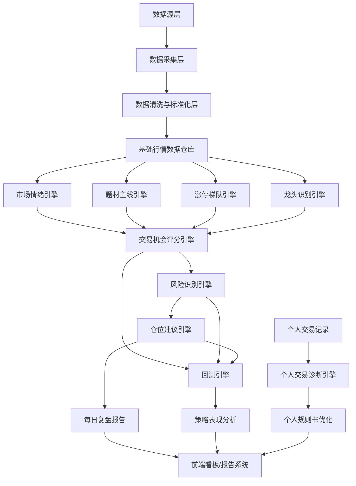

## 这是帅帅贾对 股市的重新认识-->再出发
### A股短线情绪周期复盘与龙头识别系统
### 总架构图谱
# 情绪周期交易系统总架构图谱

```mermaid
flowchart TD
    A[数据源层] --> B[数据采集层]
    B --> C[数据清洗与标准化层]
    C --> D[基础行情数据仓库]

    D --> E[市场情绪引擎]
    D --> F[题材主线引擎]
    D --> G[涨停梯队引擎]
    D --> H[龙头识别引擎]

    E --> I[交易机会评分引擎]
    F --> I
    G --> I
    H --> I

    I --> J[风险识别引擎]
    J --> K[仓位建议引擎]

    I --> L[回测引擎]
    J --> L
    K --> L

    K --> M[每日复盘报告]
    L --> N[策略表现分析]

    O[个人交易记录] --> P[个人交易诊断引擎]
    P --> Q[个人规则书优化]

    M --> R[前端看板/报告系统]
    N --> R
    Q --> R
```

### 情绪状态机